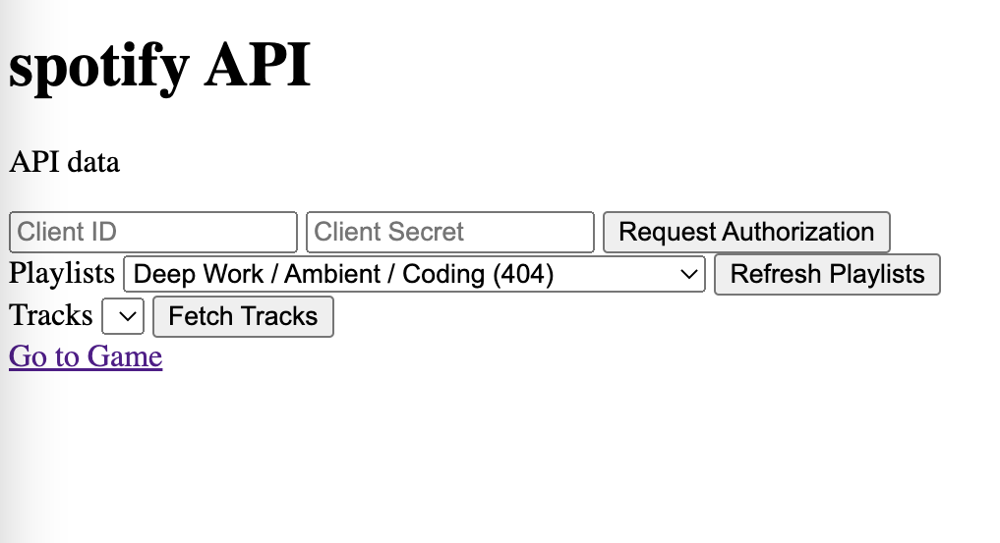
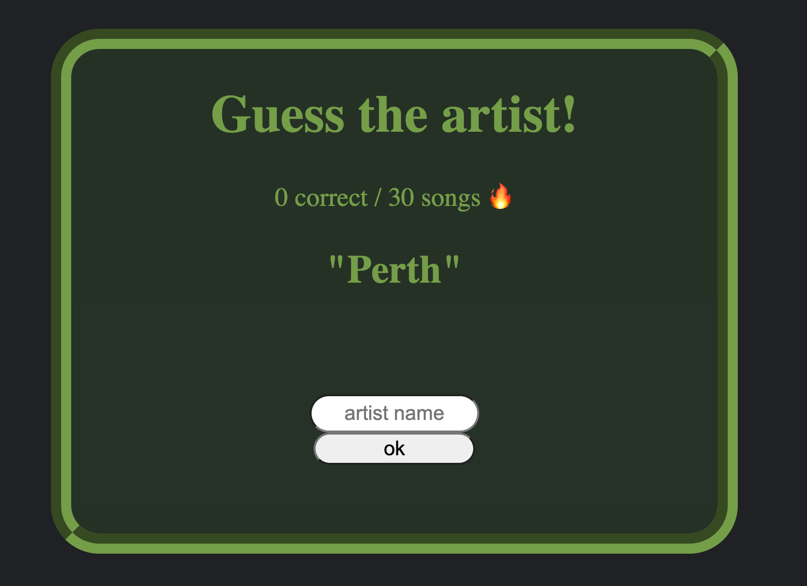
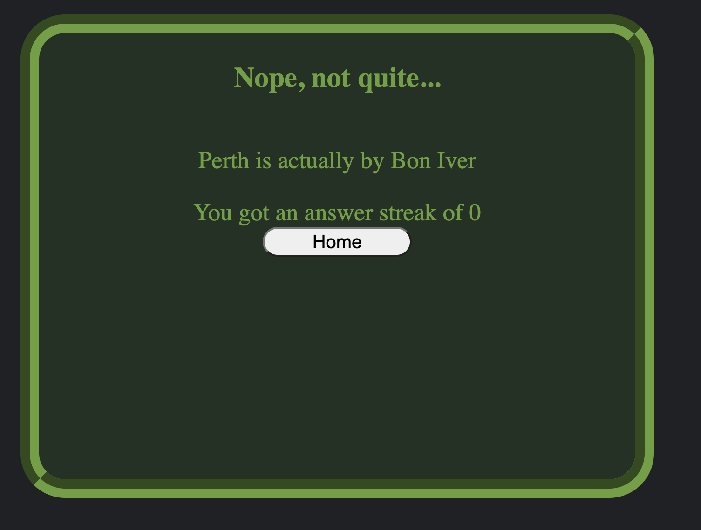

# Music Trivia Quiz

## Description

This simple song quiz utilizes the Spotify API to pull data from user playlists to create a quiz where the user guesses what artist created the song presented to them.
It serves as a fun game you can play, but doesn't offer much real-world functionality. It's real purpose was as a learning tool in its creation. Learning to use the 
Spotify API was a test in patience and endurance. The rest of the program was fairly simple to put together.
Another key point of learning, was discovering how difficult it is to work in a group situation and getting everyone on the same page. Unfortunately, I don't believe
that we ever did figure out how to successfully do it in the context of this project. Instead, it came together in spite of the actual "group" work.

## Usage

To begin using this program, you must insert the provided Client ID, Client Secret and press "Request Authorization".
Then, Spotify will ask you to give permissions to the website. (To be given access, you must have developer access. Message me, and I can grant you that if you do not 
already have access). Accept the terms, and you can move onto importing a track list from one of your playlists.
To do this, begin by pressing "Refresh Playlists" and selecting one from the dropdown menu.
Then, when your playlist is selected, click "Fetch Tracks" and you can view a full list of tracks inside of that playlist. You can now click on "Go to Game" 
and move to the quiz portion of the website.

Once in the quiz, you will be presented with a song title and you have to input the correct band or artist name and submit it to gain points. 
The paramaters are very very strict. The artist name must be typed exactly as it appears on spotify. 

Once you mess up, an end-screen will appear and 
the user will be presented with their score and what the correct answer actually was. Press "Home" and go back to the Spotify API page where you can select
a new playlist to play the game with.

## Credits

This project was worked in collaboration with Valerie Dorisme, Andrew Hughes, and Buddy Oyaye.

This tutorial and the Authorization code by MakeAtPlayCoding was a great help, and is featured, largely as he wrote it, in the spotify.js file
https://www.youtube.com/watch?v=1vR3m0HupGI&ab_channel=MakerAtPlayCoding

## License

Please refer to the LICENSE file in the repo
